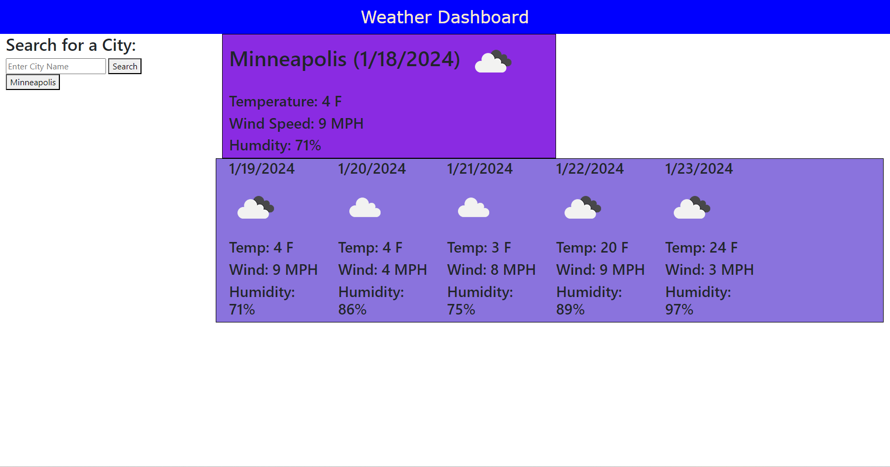

# Weather Dashboard

## Description
The goal of this Weather Dashboard is to demonstrate what I have learned about Server-Side APIs and updating HTML and CSS dynamically.

### Specific Objectives:
1. The user will See the weather outlook for multiple cities to plan a trip accordingly
2. Create a weather dashboard with inputs to search for a city
3. The search results present the current and future weather conditions 
4. Each city searched is added to the search history
4. The current weather conditions present the city name, date, a weather conditions icon, the temperature, the humidity, and the wind speed.
5. The 5-day forecast presents the date, a weather conditions icon, the temperature, the wind speed, and the humidity
6. The user can click on a city in the search history and be presented with the current and future conditions for that city

## Installation
No installation is needed to use this resource, simply follow the link to the webpage

## Screenshot

## Link
https://ms-meredith-mcd.github.io/WeatherDashboard